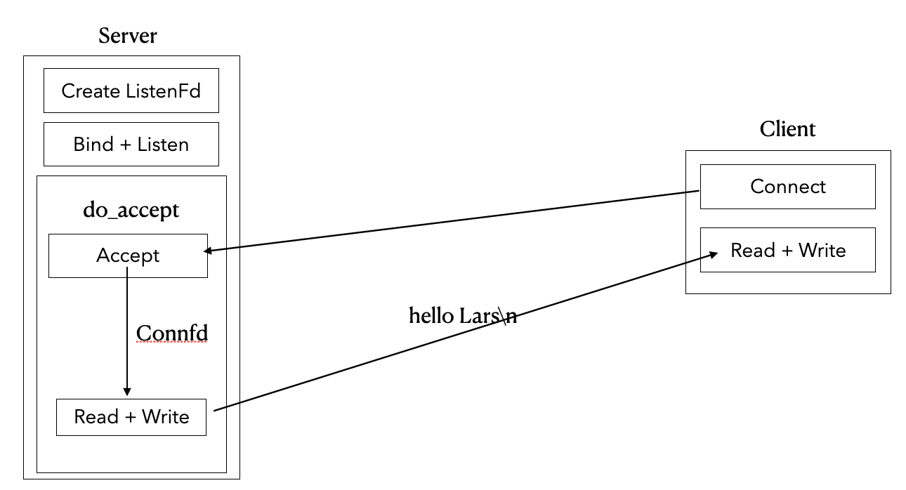

# Lars
> 刘丹冰老师[Lars](https://github.com/aceld/Lars) 负载均衡远程服务调度系统的逐章节复现，供学习理解使用，如有任何问题，请联系[email](haze188@qq.com)

## Lars Reactor v0.1-v0.12: 基于Reactor模式的LinuxC++服务器

### Lars Reactor v0.1
- 代码：[Lars_reactor_0.1](https://github.com/Hz188/Lars/tree/master/Lars_Reactor/lars_reactor_0.1)
