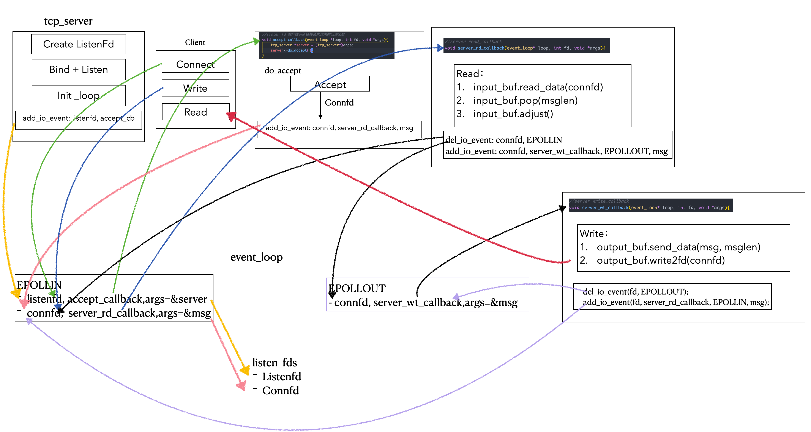
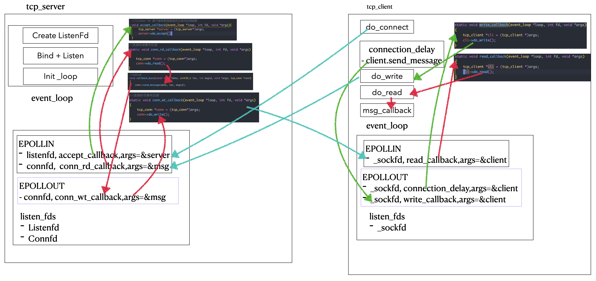

# Lars
> 刘丹冰老师[Lars](https://github.com/aceld/Lars) 负载均衡远程服务调度系统的逐章节实现
> 
> 多线程部分内容改用C++11标准库实现
> 
> 注：仅供学习理解使用，如有任何问题，请联系:haze188@qq.com

## Lars Reactor v0.1-v0.12: 基于Reactor模式的LinuxC++服务器

### Lars Reactor v0.1

- 代码：[Lars_reactor_0.1](https://github.com/Hz188/Lars/tree/master/Lars_Reactor/lars_reactor_0.1)
- Server: 单线程Accept + 无I/O复用
- Client: 无实际客户端，`nc 127.0.0.1 7777`，得到回复，不支持写

### Lars Reactor v0.2

- 代码：[Lars_reactor_0.2](https://github.com/Hz188/Lars/tree/master/Lars_Reactor/lars_reactor_0.2)
- Server: 单线程Accept + 引入io_buf(buf_pool) + 无I/O复用
- Client: 无实际客户端，`nc 127.0.0.1 7777`，支持写入消息，然后回显消息

### Lars Reactor v0.3

- 代码：[Lars_reactor_0.3](https://github.com/Hz188/Lars/tree/master/Lars_Reactor/lars_reactor_0.3)
- Server: 单线程Accept + 引入io_buf(buf_pool) + server侧I/O复用
    1. 服务器构造函数时候，将`listenFd`添加进`epoll`实例监听：`accept_callback、EPOLLIN`
    2. 客户端connect时，触发`listenfd`的`EPOLLIN`事件，回调`accept_callback`，建立连接得到`connfd`
    3. 加入监听：`server_rd_callback、EPOLLIN`
    4. 客户端write时，触发`connfd`的`EPOLLIN`事件，回调`server_rd_callback`，删除`connfd`的`EOPLLIN`事件，加入监听：`server_wt_callback、EPOLLOUT`
    5. 然后`epoll_wait`得到`EPOLLOUT`事件触发，回调`server_wt_callback`，回显消息，之后回到`3.`不断循环往复
        - 这里要注意一下EPOLLOUT事件的触发条件：套接字的发送缓冲区是空的，并且可以立即写入数据，`epoll_ctl`这个时候将套接字添加进入`epoll实例`时候，`EPOLLOUT`时间会立即触发
- Client: 无实际客户端，`nc 127.0.0.1 7777`，支持写入消息，然后回显消息

### Lars Reactor v0.4

- 代码：[Lars_reactor_0.4](https://github.com/Hz188/Lars/tree/master/Lars_Reactor/lars_reactor_0.4)
- Server: 单线程Accept + 引入io_buf(buf_pool) + server侧I/O复用
    - tcp_conn链接设置:禁止做读写缓存，降低小包延迟
        - `setsockopt(_connfd, IPPROTO_TCP, TCP_NODELAY, &op, sizeof(op));`
    - Message消息封装：TLV格式解决粘包
- Client: 无法使用`nc 127.0.0.1 7777`做测试了，因为只能接受TLV格式的报文，需要自己实现客户端

### Lars Reactor v0.4_impl_client

- 代码：[Lars_reactor_0.4_impl_cli](https://github.com/Hz188/Lars/tree/master/Lars_Reactor/lars_reactor_0.4_impl_cli)
- Server: 单线程Accept + 引入io_buf(buf_pool) + I/O复用event_loop + tcp_conn封装
- Client: Connect + io_buf(buf_pool) + I/O复用event_loop