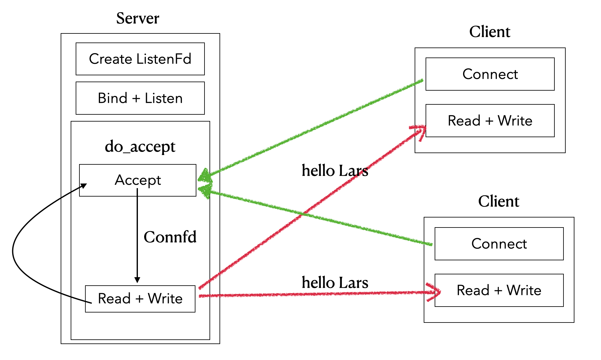
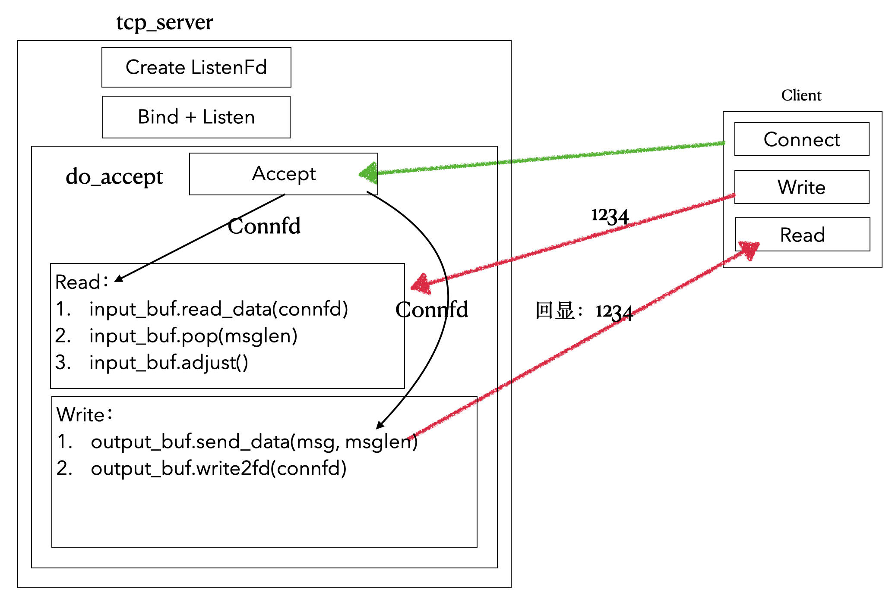

# Lars
> 刘丹冰老师[Lars](https://github.com/aceld/Lars) 负载均衡远程服务调度系统的逐章节复现
> 
> 多线程部分内容改用C++11标准库实现
> 
> 注：仅供学习理解使用，如有任何问题，请联系:haze188@qq.com

## Lars Reactor v0.1-v0.12: 基于Reactor模式的LinuxC++服务器

### Lars Reactor v0.1

- 代码：[Lars_reactor_0.1](https://github.com/Hz188/Lars/tree/master/Lars_Reactor/lars_reactor_0.1)
- Server: 单线程Accept + 无I/O复用
- Client: 无实际客户端，`nc 127.0.0.1 7777`，得到回复，不支持写

### Lars Reactor v0.2

- 代码：[Lars_reactor_0.2](https://github.com/Hz188/Lars/tree/master/Lars_Reactor/lars_reactor_0.2)
- Server: 单线程Accept + 引入io_buf(buf_pool) + 无I/O复用
- Client: 无实际客户端，`nc 127.0.0.1 7777`，支持写入msg，然后回显msg